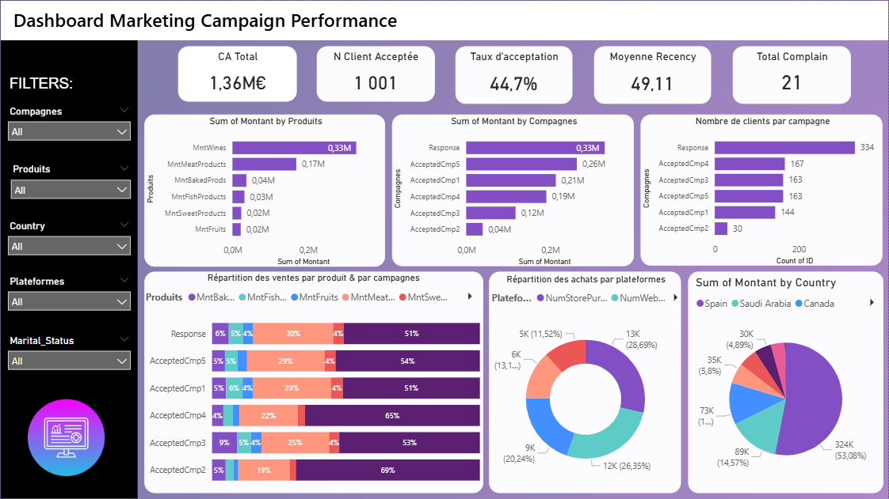

# 📊 Marketing Campaign Performance Analysis | Data Analytics Project

---
# 📊 Marketing Dashboard Preview

---

# 📌 Contexte du projet

Dans ce projet, j’interviens en tant que **Data Analyst junior** au sein d’une entreprise souhaitant :

- mesurer l’efficacité de ses campagnes marketing  
- identifier les produits les plus performants  
- comprendre le comportement d’achat des clients  

Le dataset contient :

- données démographiques des clients  
- transactions et montants d’achats  
- campagnes marketing (acceptées ou non)  
- produits et plateformes d’achat  

L’objectif est de transformer ces données en **insights exploitables pour la prise de décision business**.

---

# 🎯 Objectifs

- Réaliser une **Analyse Exploratoire des Données (EDA)**  
- Appliquer des **tests statistiques** pour valider des hypothèses  
- Transformer les données avec **Power Query**  
- Construire un **modèle de données performant**  
- Créer un **dashboard interactif Power BI** orienté business  

---

# ⚙️ Méthodologie

Le projet est structuré en 5 étapes clés 👇

---

## 1️⃣ Analyse Exploratoire des Données (Python)

### 📊 Analyses réalisées

- Identification des variables **discrètes et continues**
- Statistiques descriptives :
  - moyenne, médiane, min, max, écart-type
- Détection :
  - valeurs manquantes
  - doublons
  - anomalies

### 📈 Visualisations

- Histogrammes (distribution des ventes)
- Boxplots (détection des outliers)
- Bar charts (acceptation des campagnes)

### 🎯 Résultat

- Compréhension globale du dataset  
- Identification de tendances initiales clients & campagnes  

---

## 2️⃣ Tests Statistiques

### 🧪 Analyses effectuées

- **t-test / ANOVA** → comparaison des ventes selon les campagnes  
- **Chi²** → relation entre variables catégorielles  
- **Corrélation** → lien entre profil client et comportement d’achat  

### 📉 Interprétation

- Analyse des **p-values**
- Identification des facteurs **statistiquement significatifs**

---

## 3️⃣ Transformation des Données (Power Query)

### 🔄 Structuration des données

- Transformation en format analytique :

  - Campagnes → colonne unique  
  - Produits → colonne unique  
  - Plateformes → colonne unique  

### 🧹 Nettoyage

- Renommage des colonnes  
- Structuration logique des tables  
- Préparation pour la modélisation  

---

## 4️⃣ Modélisation des Données (Power BI)

### 🧱 Modèle relationnel

- Clé principale : **Customer ID**
- Relations entre :
  - Clients
  - Campagnes
  - Produits
  - Plateformes

### 📐 Mesures DAX

- Total des ventes  
- Ventes par campagne  
- Ventes par produit  
- Nombre de clients par campagne  

---

## 5️⃣ Dashboard – Campaign Performance

### 📊 Visualisations clés

- Nombre de clients par campagne  
- Chiffre d’affaires par campagne  
- Ventes par produit (stacked bar)  
- Répartition des achats par plateforme  

### 🎛️ Interactivité

- Slicers dynamiques :
  - Campagnes
  - Produits
  - Plateformes
  - Profil client  

### 🎯 Objectif

Créer un dashboard :

- clair  
- intuitif  
- orienté prise de décision  

---

# 📈 Insights principaux

- Identification des campagnes les plus performantes  
- Mise en évidence des produits générant le plus de revenus  
- Compréhension du comportement client selon les segments  
- Impact réel des campagnes sur les ventes  

---

# 🛠️ Technologies utilisées

- Python (Pandas, NumPy)
- Matplotlib / Seaborn
- Statistiques (t-test, ANOVA, Chi², corrélation)
- Power Query
- Power BI (DAX, Data Modeling)

---

# 📁 Structure du projet
Marketing-Campaign-Analysis
│
├── dataset.csv
│
├── eda_analysis.ipynb
│
├── dashboard.pbix
│
└── README.md

---

# 🚀 Résultat

Ce projet permet de :

- mesurer l’efficacité des campagnes marketing  
- identifier les produits les plus rentables  
- comprendre les facteurs influençant les ventes  
- fournir un outil décisionnel interactif  
